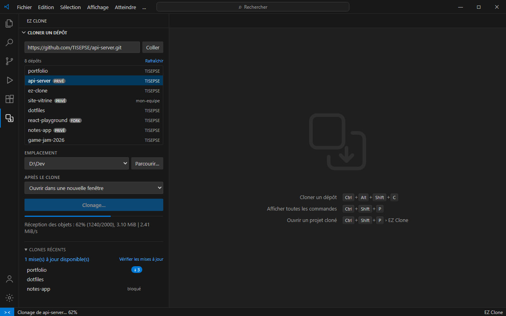

# EZ Clone

**Clone un dépôt Git depuis la barre latérale de VS Code et ouvre-le tout de suite.**

## Utilisation

1. Ouvre le panneau **EZ Clone** (`Ctrl+Alt+Shift+C`).
2. Connecte-toi à GitHub ou colle une URL.
3. Choisis un dépôt, puis **Cloner**.

## Fonctionnalités

- Tes dépôts GitHub listés et filtrables
- URL HTTPS, SSH ou `user/repo`
- Dossiers de destination mémorisés
- Nouveaux commits signalés sur tes clones, mise à jour en un clic
- Installation des dépendances proposée (`npm`, `cargo`, `pip`…)

Les mises à jour ne touchent jamais un dépôt qui a des changements locaux.
Les commandes et réglages sont dans l'onglet **Feature Contributions** et dans les paramètres de VS Code.

## Licence

MIT · [Code source](https://github.com/TISEPSE/ez-clone)
