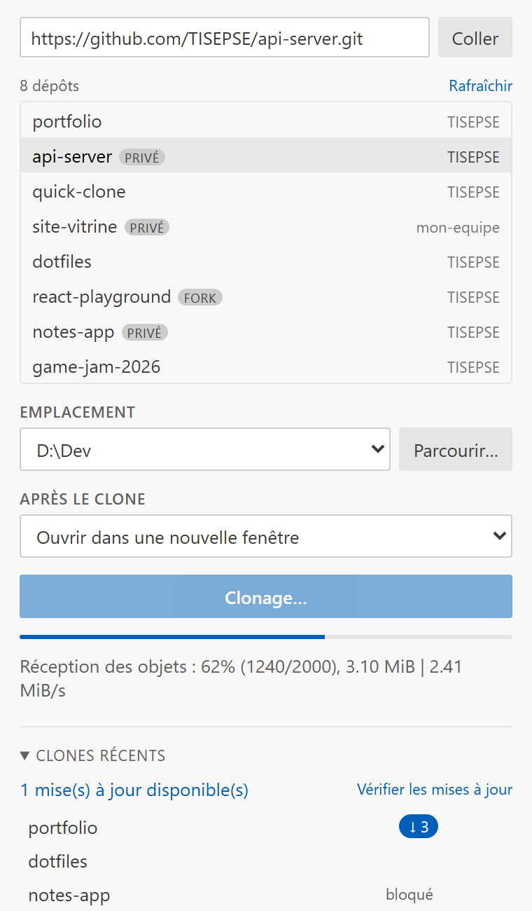

# Quick Clone for Git

**Clone un dépôt Git depuis la barre latérale de VS Code et ouvre-le tout de suite.**
Tes dépôts GitHub sont listés et filtrables, le dossier de destination est mémorisé,
et Quick Clone te prévient quand un projet cloné a de nouveaux commits.


## Fonctionnalités

- **Tous tes dépôts GitHub dans un panneau** : les tiens, ceux où tu es
  collaborateur et ceux de tes organisations, avec badges *privé* et *fork*.
  Tape quelques lettres pour filtrer, double-clique pour cloner.
- **Une URL, un `user/repo` ou le presse-papier** : colle n'importe quelle adresse
  Git (HTTPS ou SSH), elle est reconnue directement.
- **Ouverture immédiate** : nouvelle fenêtre, fenêtre courante ou ajout au
  workspace, au choix.
- **Emplacements mémorisés** : les dossiers où tu clones habituellement sont
  proposés en premier.
- **Vraie progression, annulable** : la barre suit la sortie de `git clone`, et
  annuler nettoie le dossier partiel.
- **Mises à jour des dépôts clonés** : un `git fetch` discret signale les dépôts en
  retard (`↓ 3`). La mise à jour est un simple *fast-forward*, toujours après
  confirmation, jamais au risque de perdre du travail local.
- **Installation des dépendances** : `npm`, `pnpm`, `yarn`, `cargo`, `pip`… sont
  détectés et proposés après l'ouverture du projet.
- **Connexion GitHub intégrée** : passe par le compte GitHub de VS Code, aucun
  token à créer.

## Démarrage rapide

1. Clique sur l'icône **Quick Clone** dans la barre d'activité
   (ou `Ctrl+Alt+Shift+C`).
2. Clique sur **Se connecter à GitHub**, ou colle directement une URL.
3. Choisis un dépôt, vérifie l'emplacement, puis **Cloner**.



## Le panneau

**Le champ du haut** sert à la fois d'URL et de filtre. Tape `api` et la liste
de tes dépôts se réduit ; colle une URL complète et elle est prise telle quelle.
Le bouton **Coller** récupère le presse-papier.

**La liste de tes dépôts GitHub** apparaît juste en dessous. Un clic sur un dépôt
le sélectionne, un double-clic clone directement. Le lien **Rafraîchir** recharge
la liste.

**Emplacement** est une liste déroulante des dossiers connus, avec **Parcourir…**.

**Après le clone** : nouvelle fenêtre, fenêtre courante, workspace, ou rien.

**Clones récents** : un clic sur le nom rouvre le projet dans une nouvelle fenêtre.
`Ctrl`/`Cmd` + clic, ou le bouton `⇱` au survol, l'ouvre dans la fenêtre courante.
La croix retire l'entrée de la liste, sans toucher au disque.

## Raccourci et commandes

- `Ctrl+Alt+Shift+C` (`Cmd+Alt+Shift+C` sur macOS) ouvre le panneau, curseur dans le champ URL.
- `Quick Clone: Cloner un dépôt (au clavier, sans la barre latérale)` : parcours
  100 % clavier.
- `Quick Clone: Ouvrir un projet cloné` : rouvre un projet de l'historique.
- `Quick Clone: Vérifier les mises à jour des dépôts clonés` : force une
  vérification et propose de tout mettre à jour.

## Mise à jour des dépôts clonés

- Au démarrage, au retour sur la fenêtre, puis au plus une fois toutes les
  `quickClone.updateCheckInterval` minutes, un `git fetch --prune` silencieux est
  lancé sur les clones récents.
- La mise à jour est un `git merge --ff-only @{u}` : jamais de fusion, jamais de
  rebase, jamais de perte de travail local.
- Un dépôt est marqué **bloqué** et laissé tel quel s'il a des commits non poussés,
  des modifications non commitées, un HEAD détaché ou aucune branche de suivi.
- `quickClone.autoCheckUpdates: false` désactive les vérifications automatiques.

L'historique des clones suit ton compte via Settings Sync. Seuls les *commits*
voyagent : le travail non commité et les fichiers ignorés (`.env`, `node_modules`)
restent sur la machine.

## Connexion GitHub

Elle passe par le fournisseur d'authentification intégré de VS Code (le même que
l'extension GitHub officielle) : aucun token à créer ni à stocker, et le compte est
révocable depuis le menu **Comptes**. Les autorisations demandées sont `repo`
(pour voir les dépôts privés) et `read:org`.

## Réglages

| Clé | Défaut | Rôle |
|---|---|---|
| `quickClone.defaultRoot` | `""` | Emplacement en tête de liste (`~` accepté) |
| `quickClone.openBehavior` | `ask` | Comportement de la commande clavier |
| `quickClone.depth` | `0` | `--depth` appliqué aux clones ; `0` = clone complet |
| `quickClone.recurseSubmodules` | `false` | `--recurse-submodules` appliqué aux clones |
| `quickClone.shorthandHost` | `https://github.com/` | Hôte pour les raccourcis `user/repo` |
| `quickClone.postCloneSetup` | `ask` | Installation des dépendances : `ask` / `always` / `never` |
| `quickClone.github.protocol` | `https` | `https` ou `ssh` pour les clones depuis la liste GitHub |
| `quickClone.github.hideArchived` | `true` | Masquer les dépôts archivés |
| `quickClone.autoCheckUpdates` | `true` | Vérifier en arrière-plan les nouveaux commits |
| `quickClone.updateCheckInterval` | `30` | Délai minimum entre deux vérifications, en minutes |
| `quickClone.maxRecentDestinations` | `8` | Taille de la liste des emplacements |

## Lien externe

L'extension enregistre un gestionnaire d'URI qui ouvre le panneau avec l'URL
pré-remplie :

```
vscode://tisepse.quick-clone/clone?url=https://github.com/user/repo.git
```

## Bon à savoir

- Le binaire git vient de l'extension Git intégrée : ton réglage `git.path` est respecté.
- Si le dossier cible existe déjà, Quick Clone propose de l'ouvrir ou de renommer.
- Desktop uniquement : pas de support vscode.dev / github.dev.
- Un dépôt privé nécessite un credential helper git configuré ; sinon le clone
  échoue avec un message explicite plutôt que de rester bloqué.

## Développement

```sh
npm install
npm run compile        # ou npm run watch
npm run package        # produit le .vsix
```

`F5` lance une fenêtre « Extension Development Host » avec l'extension chargée.

Code source et signalement de bugs : [github.com/TISEPSE/quick-clone](https://github.com/TISEPSE/quick-clone)

## Licence

MIT
